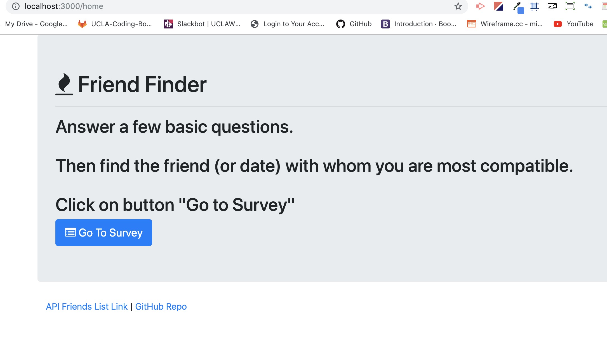
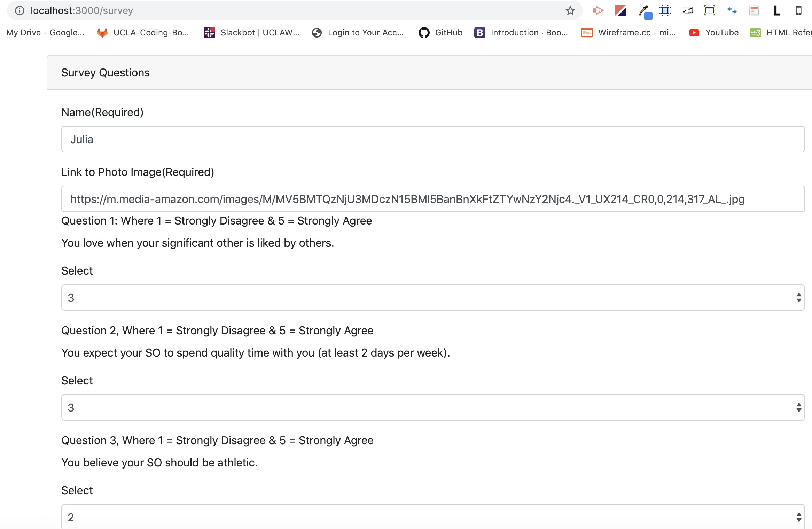
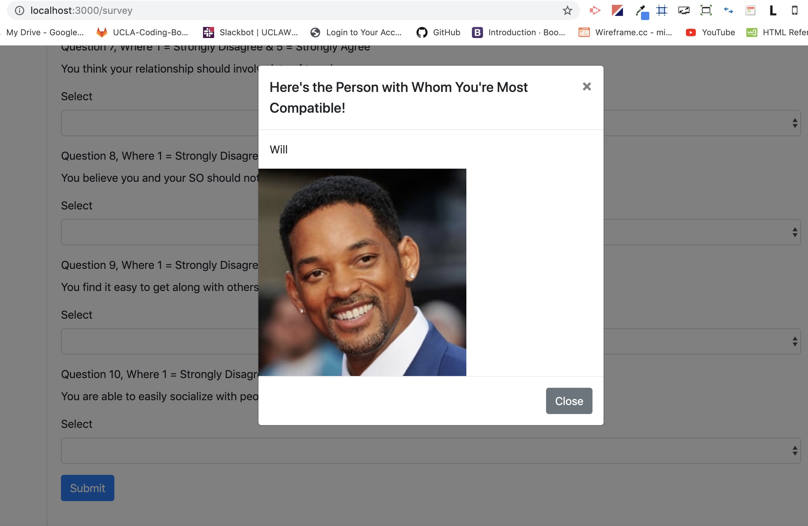
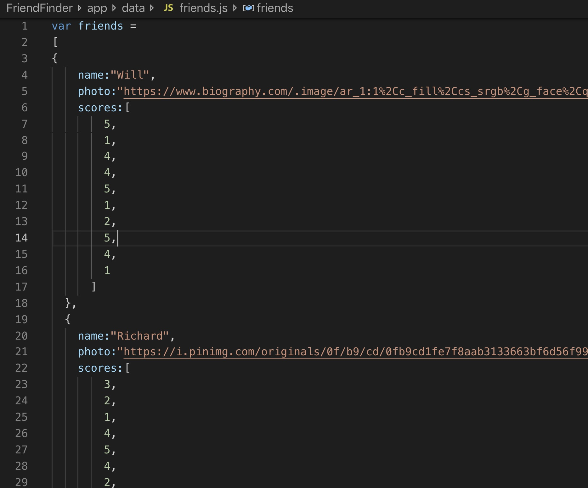

# FriendFinder
FriendFinder is a compatibility-based application used to find dates or best matches for people based on minimum differences in scores to selected questions. This full-stack site takes in results from users' surveys, then compares their answers with those from other users. The app will then display the name and picture of the user with the best overall match.

Express will be used to handle routing. Make sure you deploy your app to Heroku so other users can fill it out.

In order to test this code using nodemon, ensure you are in the root directory of the server.js file and run nodemon server.js so you don't have to restart and reload the server with each change/client input.

Have your dependencies for express in your package.json file:

HTML GET requests to http://localhost:3000/ render the survey home page to the user (this is the default page if path survey is not entered):

URL http://localhost:3000/survey brings the user to the survey page. The user must enter his/her name and include a link to a photo. The survey has 10 questions with answers on a scale of 1 to 5 based on how much the user agrees or disagrees with a question. I

When the user submits the survey, the POST route "/api/friends" handles the results. When Jennifer Lopez is entered as a name and a link to her photo is included, the survey is filled in with the exact same answers as Will (Will Smith), which is why a modal with Will Smith populates as her best match (user with the least amount of difference in answers).

Here's what's occuring prior to receiving a response from the server:
An array of "friends" objects is stored inside of `app/data/friends.js` as an array of objects. Each of these objects should roughly follow the format below.

The user's most compatible friend is determined using the following as a guide:

   * Each user's results is converted into a simple array of numbers (ex: `[5, 1, 4, 4, 5, 1, 2, 5, 4, 1]`). Then ABSOLUTE difference between the current user's scores is compared against those from other users, question by question. The differences are added to calculate the `totalDifference`. The user is matched with the friend with the least amount of difference in answers.
     * Example:
       * User 1: `[5, 1, 4, 4, 5, 1, 2, 5, 4, 1]`
       * User 2: `[3, 2, 6, 4, 5, 1, 2, 5, 4, 1]`
       * Total Difference: **2 + 1 + 2 =** **_5_**
   
   

