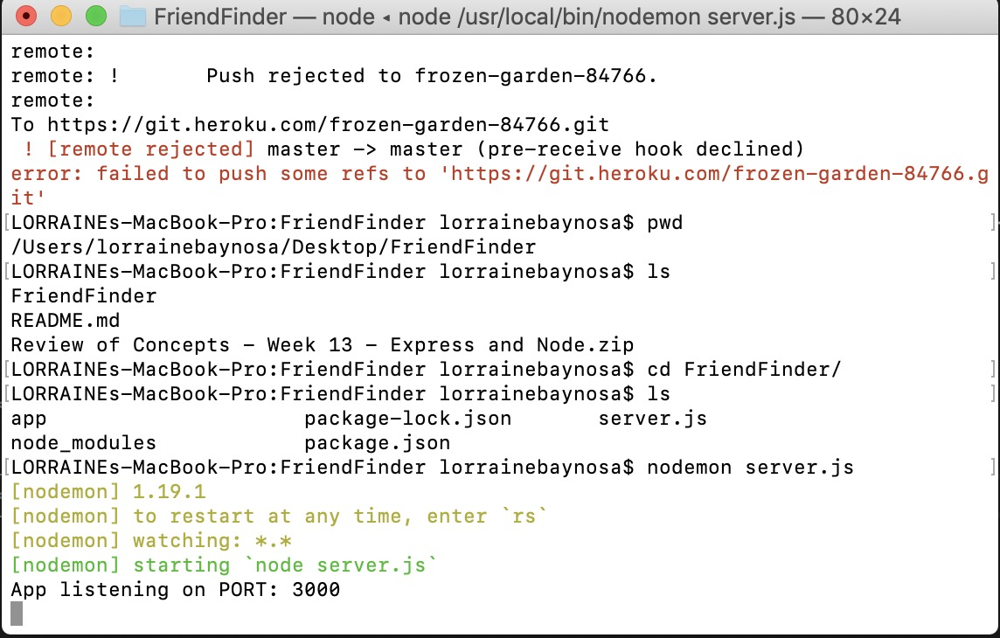
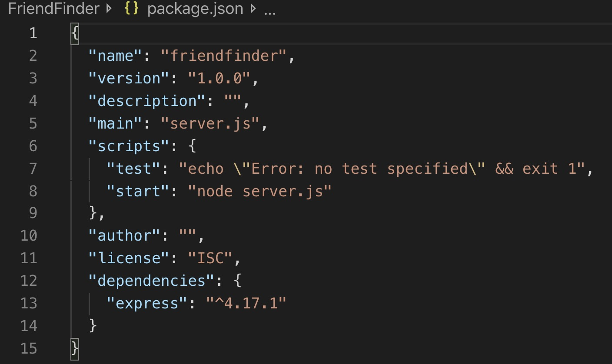

# FriendFinder
FriendFinder is a compatibility-based application used to find dates or best matches for people based on minimum differences on scores to selected questions. This full-stack site takes in results from users' surveys, then compare their answers with those from other users. The app will then display the name and picture of the user with the best overall match.

Express will be used to handle routing. Make sure you deploy your app to Heroku so other users can fill it out.

In order to test this code using nodemon, ensure you are in the root directory of the server.js file and run nodemon server.js so you don't have to restart and reload the server with each change/client input.





Have your dependencies for express in your package.json file:





HTML GET requests to http://localhost:3000/home render the home survey page to the user:

1. The survey has 10 questions of your choosing. Each answer should be on a scale of 1 to 5 based on how much the user agrees or disagrees with a question.

2. The `server.js` file requires the basic npm packages `express` and `path`.

3. The `htmlRoutes.js` file includes two routes:

   * A GET Route to `/survey` which should display the survey page.
   * A default, catch-all route that leads to `home.html` which displays the home page.

4. The `apiRoutes.js` file contains two routes:

   * A GET route with the url `/api/friends`. This will be used to display a JSON of all possible friends.
   * A POST routes `/api/friends`. This will be used to handle incoming survey results. This route will also be used to handle the compatibility logic.

5. You should save your application's data inside of `app/data/friends.js` as an array of objects. Each of these objects should roughly follow the format below.

```json
{
  "name":"Ahmed",
  "photo":"https://media.licdn.com/mpr/mpr/shrinknp_400_400/p/6/005/064/1bd/3435aa3.jpg",
  "scores":[
      5,
      1,
      4,
      4,
      5,
      1,
      2,
      5,
      4,
      1
    ]
}
```

6. Determine the user's most compatible friend using the following as a guide:

   * Convert each user's results into a simple array of numbers (ex: `[5, 1, 4, 4, 5, 1, 2, 5, 4, 1]`).
   * With that done, compare the difference between current user's scores against those from other users, question by question. Add up the differences to calculate the `totalDifference`.
     * Example:
       * User 1: `[5, 1, 4, 4, 5, 1, 2, 5, 4, 1]`
       * User 2: `[3, 2, 6, 4, 5, 1, 2, 5, 4, 1]`
       * Total Difference: **2 + 1 + 2 =** **_5_**
   * Remember to use the absolute value of the differences. Put another way: no negative solutions! Your app should calculate both `5-3` and `3-5` as `2`, and so on.
   * The closest match will be the user with the least amount of difference.

7. Once you've found the current user's most compatible friend, display the result as a modal pop-up.
   * The modal should display both the name and picture of the closest match.
